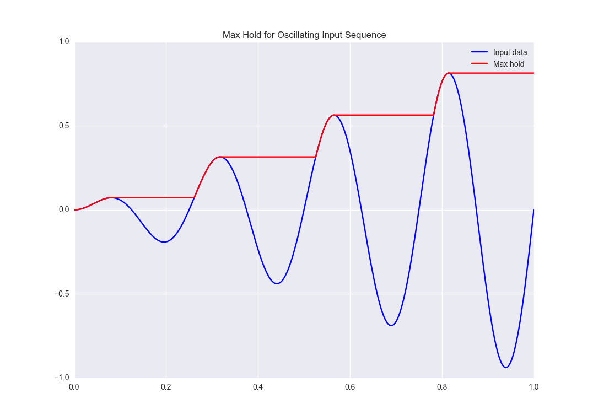
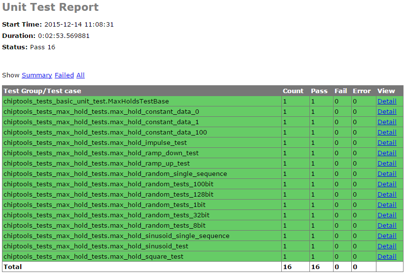
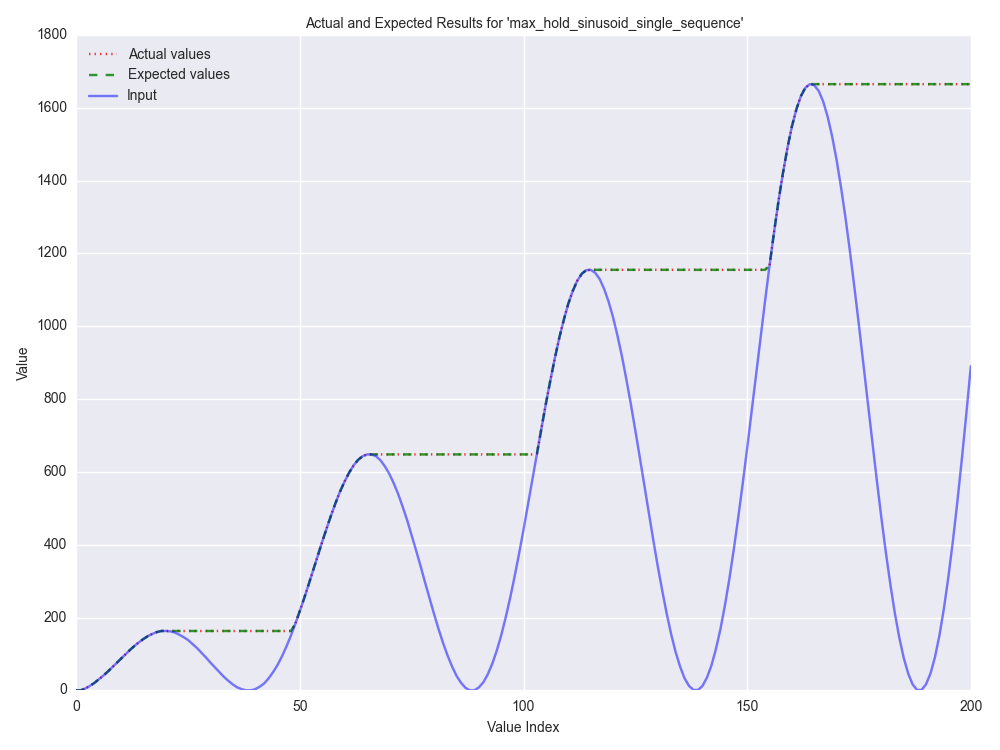

.. _max_hold:

Examples: Max Hold
==================

A demonstration of the ChipTools framework being used to simulate, test and
build a simple VHDL component.

Introduction
------------

The **Max Hold** example implements a basic component to output the maximum
value of an input sequence until it is reset. For example, if such a component
were to be fed an oscillating input with steadily increasing amplitude we would
expect the following result:

This example will show you how you can use ChipTools to generate stimulus, 
check responses, create test reports and generate bit files for the 
**Max Hold** component.

Source Files
------------

The Max Hold example is located in `examples/max_hold <https://github.com/pabennett/chiptools/tree/master/examples/max_hold>`_.

The following source files belong to the Max Hold example:

.. csv-table::
   :header: "Name", "Type", "Description"
   :widths: 20, 20, 10

   "max_hold.vhd",        "**VHDL**",          "Max Hold component (VHDL)."
   "pkg_max_hold.vhd",    "**VHDL**",          "Package for Max Hold component."
   "tb_max_hold.vhd",     "**VHDL**",          "Testbench for Max Hold component (VHDL)."
   "max_hold.sv",         "**SystemVerilog**", "Max Hold component (SystemVerilog)."
   "tb_max_hold.sv",      "**SystemVerilog**", "Testbench for Max Hold component (SystemVerilog)."

Support files:

.. csv-table::
   :header: "Name", "Type", "Description"
   :widths: 20, 20, 10

   "max_hold_tests.py",   "**Unit Test**",     "Collection of advanced unit tests."
   "basic_unit_tests.py", "**Unit Test**",     "Simple unit test."
   "max_hold.xml",        "**Project**",       "Project file (using VHDL sources)."
   "max_hold_sv.xml",     "**Project**",       "Project file (using SystemVerilog sources)."
   "max_hold.ucf",        "**Constraints**",   "Constraints file when using the ISE synthesis flow."
   "max_hold.xdc",        "**Constraints**",   "Constraints file when using the Vivado synthesis flow."
   "simulation",          "**Folder**",        "Output directory for simulation tasks."
   "synthesis",           "**Folder**",        "Output directory for synthesis tasks."

The Max Hold component has been designed in both VHDL and SystemVerilog so that
single-language simulators such as GHDL or Icarus can be used.

Creating the Project
---------------------

This section will walk through the steps required to load and use the source
files with ChipTools. The complete example is available in 
**max_hold_project.py** in the Max Hold project directory.

Initial Setup
~~~~~~~~~~~~~

First, import the ChipTools Project wrapper and create a project instance:

.. code-block:: python

    from chiptools.core.project import Project

    # Create a new Project
    project = Project()

The project wrapper provides a set of functions for loading source files and
configuring a project.

Project Configuration
~~~~~~~~~~~~~~~~~~~~~

Projects should be configured with the following information before they are 
used:

.. csv-table::
   :header: "Configuration Item", "Description"
   :widths: 10, 20

   "simulation_directory", "Output directory for simulation tasks."
   "synthesis_directory", "Output directory for synthesis tasks."
   "fpga_part", "The FPGA part to target when performing a synthesis flow."
   "simulator", "Name of the default simulator to use when performing simulations."
   "synthesiser", "Name of the default synthesiser to use when performing synthesis."

The project wrapper provides two methods for setting configuration data: 
**add_config**, which accepts a name, value pair as arguments or
**add_config_dict**, which accepts a dictionary of name, value pairs.

The following code sample uses the **add_config** method to configure the
project wrapper.

.. code-block:: python

    # Configure project, you may wish to edit some of these settings depending
    # on which simulation/synthesis tools are installed on your system.
    project.add_config('simulation_directory', 'simulation')
    project.add_config('synthesis_directory', 'synthesis')
    project.add_config('simulator', 'ghdl')
    project.add_config('synthesiser', 'ise')
    project.add_config('part', 'xc6slx9-csg324-2')

Apply Values to Generic Ports
~~~~~~~~~~~~~~~~~~~~~~~~~~~~~

FPGA designs can be parameterised via the use of a generic port on the top level
component. You can assign values to top level port generics by using the 
**add_generic** method:

.. code-block:: python

    # Synthesis generics can be assigned via the add_generic command, in this
    # example we set the data_width generic to 3:
    project.add_generic('data_width', 3)

Add Source Files
~~~~~~~~~~~~~~~~

Add the Max Hold source files to the project and assign them to a library:

.. code-block:: python

    # Source files for the max_hold component are added to the project. The Project
    # **add_file** method accepts a file path and library name, if no library is
    # specified it will default to 'work'. Other file attributes are available but
    # not covered in this example.
    project.add_file('max_hold.vhd', library='lib_max_hold')
    project.add_file('pkg_max_hold.vhd', library='lib_max_hold')

The testbench is also added to the project under a different library.
The optional argument *synthesise* is set to **False** when adding the testbench
as we do not want to include it in the files sent to synthesis:

.. code-block:: python

    # When adding the testbench file we supply a 'synthesise' attribute and set it
    # to 'False', this tells the synthesis tool not to try to synthesise this file.
    # If not specified, 'synthesise' will default to 'True'
    project.add_file(
        'tb_max_hold.vhd',
        library='lib_tb_max_hold',
        synthesise=False
    )

There are two unit test files provided for the Max Hold project, these can be
added to the project using the **add_unittest** method:

.. code-block:: python

    # Unit tests have been written for the max_hold component and stored in
    # max_hold_tests.py. The Project class provides an 'add_unittest' method for
    # adding unit tests to the project, it expects a path to the unit test file.
    project.add_unittest('max_hold_tests.py')
    project.add_unittest('basic_unit_test.py')

Finally, the constraints files can be added to the project using the 
**add_constraints** method, which takes a **path** argument and an optional
**flow** name argument which allows you to explicitly name which synthesis flow
the constraints are intended for:

.. code-block:: python

    # The constraints are added to the project using the add_constraints method.
    # The optional 'flow' argument is used to explicitly identify which synthesis
    # flow the constraints are intended for (the default is to infer supported
    # flows from the file extension).
    project.add_constraints('max_hold.xdc', flow='vivado')
    project.add_constraints('max_hold.ucf', flow='ise')

The project is now fully configured and can be synthesised, simulated or the
unit test suite can be executed to check that the requirements are met:

.. code-block:: python

    # Simulate the project interactively by presenting the simulator GUI:
    project.simulate(
        library='lib_tb_max_hold',
        entity='tb_max_hold',
        gui=True,
        tool_name='modelsim'
    )
    # Run the automated unit tests on the project (console simulation):
    project.run_tests(tool_name='isim')
    # Synthesise the project:
    project.synthesise(
        library='lib_max_hold',
        entity='max_hold',
        tool_name='vivado'
    )

Alternatively the ChipTools command line can be launched on the project to
enable the user to run project operations interactively:

.. code-block:: python

    # Launch the ChipTools command line with the project we just configured:
    from chiptools.core.cli import CommandLine
    CommandLine(project).cmdloop()

Project (XML) File
~~~~~~~~~~~~~~~~~~

The Project configuration can also be captured as an XML file, which provides
an alternative method of maintaining the project configuration.

The example project file **max_hold.xml** provides the same configuration as 
**max_hold_project.py**:

.. code-block:: xml

    <project>
        <config simulation_directory='simulation'/>
        <config synthesis_directory='synthesis'/>
        <config simulator='ghdl'/>
        <config synthesiser='vivado'/>
        <config part='xc7a100tcsg324-1'/>
        <unittest path='max_hold_tests.py'/>
        <unittest path='basic_unit_test.py'/>
        <constraints path='max_hold.ucf' flow='ise'/>
        <constraints path='max_hold.xdc' flow='vivado'/>
        <generic data_width='3'/>
        <library name='lib_max_hold'>
            <file path='max_hold.vhd'/>
            <file path='pkg_max_hold.vhd'/>
        </library>
        <library name='lib_tb_max_hold'>
            <file 
                path='tb_max_hold.vhd'
                synthesise='false'
            />
        </library>
    </project>

The project XML file can be loaded in the ChipTools command line interface 
using the **load_project** command:

.. code-block:: bash

    $ chiptools
    (cmd) load_project max_hold.xml

...or in a Python script:

.. code-block:: python

    from chiptools.core.project import Project

    # Create a new Project
    project = Project()
    # Load a pre-existing project file
    project.load_project('max_hold.xml')

Simulation and Test
--------------------

To test the Max Hold component an accompanying testbench, *tb_max_hold.vhd*
(VHDL) or *tb_max_hold.sv* (SystemVerilog), is used to feed the component data
from a stimulus input text file and record the output values in an output text
file. By using stimulus input files and output files we gain the freedom to use
the language of our choice to generate stimulus and check results.

A simple stimulus file format is used by the testbench that allows a data write
or a reset to be issued to the unit under test:

+-----------------------------------------------------------------------------+
|                    Stimulus File Format                                     |
+------------------------+----------------------------------------------------+
| Reset (1-bit) (Binary) | Data (N-bit) (Binary)                              |
+------------------------+----------------------------------------------------+
| Reset (1-bit) (Binary) | Data (N-bit) (Binary)                              |
+------------------------+----------------------------------------------------+
|                            ... Repeated                                     |  
+-----------------------------------------------------------------------------+

The width of the binary data field must match the data width on the testbench
generic. On each clock cycle a single line should be read from the stimulus
file and the supplied values sent to the input of the Max Hold component.

We will use Python to create stimulus files in this format for the testbench.

Unit Tests
~~~~~~~~~~

.. note::  The following example can be found in **examples/max_hold/basic_unit_test.py**

We can use Python to define tests for the Max Hold component by first importing
the **ChipToolsTest** class from **chiptools.testing.testloader**

.. code-block:: python
    
    from chiptools.testing.testloader import ChipToolsTest

The **ChipToolsTest** class provides a wrapper around Python's Unittest
**TestCase** class that will manage simulation execution behind the scenes
while our test cases are executed.

First off, create a ChipToolsTest class and define some basic information about
the testbench:

.. code-block:: python

    class MaxHoldsTestBase(ChipToolsTest):
        # Specify the duration your test should run for in seconds.
        # If the test should run until the testbench aborts itself use 0.
        duration = 0
        # Testbench generics are defined in this dictionary.
        # In this example we set the 'width' generic to 32, it can be overridden
        # by your tests to check different configurations.
        generics = {'data_width': 32}
        # Specify the entity that this Test should target
        entity = 'tb_max_hold'
        # Specify the library that this Test should target
        library = 'lib_tb_max_hold'

These attributes provide the basic information required by ChipTools to execute
the testbench.

Tests are executed using the following sequence when using the Python Unittest
framework:

    #. Execute the unit test class **setUp** function if defined.
    #. Execute the test case (a test case is any class method with a 'test prefix').
    #. Execute the unit test class **tearDown** function if defined.

If the unit test class provides multiple testcases they can be executed
individually or as a batch in ChipTools. The sequence above is executed for
each individual test case.

The **setUp** function executes before each test and can be used to prepare any
inputs that do not change for each test. In this example we will simply use the
setUp function to prepare the test environment by defining paths to the input
and output files to be used by the testbench:

.. code-block:: python

    def setUp(self):
        """Place any code that is required to prepare simulator inputs in this
        method."""
        # Set the paths for the input and output files using the
        # 'simulation_root' attribute as the working directory
        self.input_path = os.path.join(self.simulation_root, 'input.txt')
        self.output_path = os.path.join(self.simulation_root, 'output.txt')

Similarly, the **tearDown** function executes at the end of each test, so we can
use this to remove any files that were generated during the test:

.. code-block:: python

    def tearDown(self):
        """Insert any cleanup code to remove generated files in this method."""
        os.remove(self.input_path)
        os.remove(self.output_path)

To execute our tests we will create a function that performs the following
operations:

#. Create an array of N random integers
#. Write the array of integers to the input stimulus file
#. Execute the simulation and check that the return code is 0
#. Read the output data generated by the simulation
#. Compare the output data to our Python model of the Max Hold function.

.. code-block:: python

    def run_random_data_test(self, n):

        # Generate a list of n random integers
        self.values = [random.randint(0, 2**32-1) for i in range(n)]

        # Write the values to the testbench input file
        with open(self.input_path, 'w') as f:
            for value in self.values:
                f.write(
                    '{0} {1}\n'.format(
                        '0',  # Reset status (0) 
                        bin(value)[2:].zfill(32),  # write 32bit data
                    )
                )

        # Run the simulation
        return_code, stdout, stderr = self.simulate()
        self.assertEqual(return_code, 0)

        # Read the simulation output
        output_values = []
        with open(self.output_path, 'r') as f:
            data = f.readlines()
        for valueIdx, value in enumerate(data):
            # testbench response
            output_values.append(int(value, 2))  # Binary to integer

        # Use Python to work out the expected result from the original imput
        max_hold = [
            max(self.values[:i+1]) for i in range(len(self.values))
        ]

        # Compare the expected result to what the Testbench returned:
        self.assertListEqual(output_values, max_hold)

Now we can add extra functions to our class using the 'test' prefix to execute
**run_random_data_test** with different parameters:

.. code-block:: python

    def test_10_random_integers(self):
        """Check the Max hold component using 10 random integers."""
        self.run_random_data_test(10)

    def test_100_random_integers(self):
        """Check the Max hold component using 100 random integers."""
        self.run_random_data_test(100)

The above example is saved as **basic_unit_test.py** in the Max Hold 
example folder. We can run this test by invoking ChipTools in the example
folder, loading the **max_hold_basic_test.xml** project and then adding and running the
testsuite (simulator output has been hidden for presentation purposes):

.. code-block:: bash

    $ chiptools
    (Cmd) load_project max_hold_basic_test.xml
    (Cmd) run_tests
    ok test_100_random_integers (chiptools_tests_basic_unit_test.MaxHoldsTestBase)
    ok test_10_random_integers (chiptools_tests_basic_unit_test.MaxHoldsTestBase)
    Time Elapsed: 0:00:11.967197
    (Cmd)

Unit Test Report
~~~~~~~~~~~~~~~~

When ChipTools has finished running a test suite invoked with the **run_tests**
command it will place a report called **report.html** in the simulation 
directory. The unit test report indicates which tests passed or failed and
provides debug information on tests that have failed. A sample report for the
full Max Hold unit test suite is given below:

.. note::  The test report is overwritten each time the unit test suite is executed, so backup old reports if you want to keep them.

Advanced Unit Tests
~~~~~~~~~~~~~~~~~~~~

The previous example showed how a simple unit test can be created to test the 
Max Hold component with random stimulus. This approach can be extended to 
produce a large set of tests to thoroughly test the component and provide
detailed information about how it is performing. The **max_hold_tests.py**
file in the Max Hold example folder implements the following tests:

.. csv-table::
   :header: "Test Name", "Data Width", "Description"
   :widths: 20, 5, 30

   "max_hold_constant_data_0", 32, "Continuous data test using zero"
   "max_hold_constant_data_1", 32, "Continuous data test using 1"
   "max_hold_constant_data_100", 32, "Continuous data test using 100"
   "max_hold_impulse_test", 32, "The first data point is nonzero followed by constant zero data." 
   "max_hold_ramp_down_test", 32, "Successive random length sequences of reducing values."
   "max_hold_ramp_up_test", 32, "Successive random length sequences of increasing values."
   "max_hold_random_single_sequence", 32, "Single sequence of 200 random values."
   "max_hold_random_tests_100bit", 100, "Successive random length sequences of 100bit random values."
   "max_hold_random_tests_128bit", 128, "Successive random length sequences of 128bit random values." 
   "max_hold_random_tests_1bit", 1, "Successive random length sequences of 1bit random values."
   "max_hold_random_tests_32bit", 32, "Successive random length sequences of 32bit random values." 
   "max_hold_random_tests_8bit", 8, "Successive random length sequences of 8bit random values." 
   "max_hold_sinusoid_single_sequence", 12, "Single sinusoidal sequence."  
   "max_hold_sinusoid_test", 12, "Multiple sinusoidal sequences of random length." 
   "max_hold_square_test", 8, "Multiple toggling sequences of random length."

If **Matplotlib** is installed the Unit Test will also
create an output image for each test in the simulation folder to show a graph
of the input data with the model data and the Max Hold component output data.
For example, the max_hold_sinusoid_single_sequence test produces the following
output:

.. note:: For this example, graph generation requires `Matplotlib <https://matplotlib.org/>`_ (optionally with `Seaborn <http://seaborn.pydata.org/>`_)

Plots such as these provide a powerful diagnostic tool when debugging
components or analysing performance.

Synthesis and Build
-------------------

.. warning:: The **Max Hold** example is provided to demonstrate the ChipTools
             build process, do not attempt to use the bitfiles generated from
             this project on an FPGA as the IO constraints are not fully defined
             and have not been checked. Using the bitfiles generated from this
             project may cause damage to your device.

The Max Hold example includes the files necessary for it to be built using the
Xilinx ISE, Vivado and Quartus synthesis flows; the project files provided
in the example are configured to use the Vivado synthesis flow by default.

Building with the Command Line Interface
~~~~~~~~~~~~~~~~~~~~~~~~~~~~~~~~~~~~~~~~

To build the design using the ChipTools command line, first open a terminal in
the Max Hold example directory and invoke the ChipTools command line:

.. code-block:: bash

  $ chiptools
  -------------------------------------------------------------------------------
  ChipTools (version: 0.1.50)

  Type 'help' to get started.
  Type 'load_project <path>' to load a project.
  The current directory contains the following projects:
          1: max_hold.xml
          2: max_hold_basic_test.xml
  -------------------------------------------------------------------------------
  (cmd)

Two projects should be listed by ChipTools in the current directory, load the 
**max_hold.xml** project by using the **load_project** command:

.. code-block:: bash

  (Cmd) load_project max_hold.xml
  [INFO] Loading max_hold.xml in current working directory: max_hold
  [INFO] Loading project: max_hold.xml
  [INFO] Parsing: max_hold.xml synthesis=None
  (Cmd)

We can check which files will be sent to the synthesis tool by using the
**show_synthesis_fileset** command:

.. code-block:: bash

  (Cmd) show_synthesis_fileset
  [INFO] Library: lib_max_hold
  [INFO]          max_hold.vhd
  [INFO]          pkg_max_hold.vhd
  [INFO] Library: lib_tb_max_hold

Note that the Max Hold testbench **tb_max_hold.vhd** is excluded from
synthesis, this is due to the *synthesis='false'* attribute on the testbench
file tag in the **max_hold.xml** project file.

An FPGA build can be initiated by using the **synthesise** command, which 
accepts the following arguments:

.. csv-table::
   :header: "Argument", "Description"
   :widths: 5, 20

   "target", "The library and entity to synthesise, using the format *library.entity*"
   "flow", "The synthesis flow to use. The default value is taken from the project config."
   "part", "The fpga part to use. The default value is taken from the project config."

To build the Max Hold project using the default synthesis flow (Vivado) for the
default FPGA part (xc7a100tcsg324-1) simply issue the synthesise command
with the target library and entity:

.. code-block:: bash

  (Cmd) synthesise lib_max_hold.max_hold

To build the Max Hold project using *Altera Quartus*, issue the synthesise
command with the flow set to 'quartus' and the part set to 'EP3C40F484C6'.

.. code-block:: bash

  (Cmd) synthesise lib_max_hold.max_hold quartus EP3C40F484C6

To build the Max Hold project using *Xilinx ISE*, issue the synthesise
command with the flow set to 'ise' and the part set to 'xc6slx9-csg324-2'.

.. code-block:: bash

  (Cmd) synthesise lib_max_hold.max_hold ise xc6slx9-csg324-2

While the build is running any messages generated by the synthesis tool will
be displayed in the ChipTools command line. When the build has completed
ChipTools will store any build outputs in a timestamped archive in the
synthesis output directory specified in the project settings:

.. code-block:: bash

  [INFO] Build successful, checking reports for unacceptable messages...
  [INFO] Synthesis completed, saving output to archive...
  [INFO] Added: max_hold_synth_151215_134719
  [INFO] ...done
  (cmd)

If there is an error during build, ChipTools will store any outputs generated
by the synthesis tool in a timestamped archive with an 'ERROR' name prefix.
